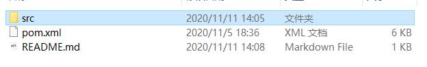
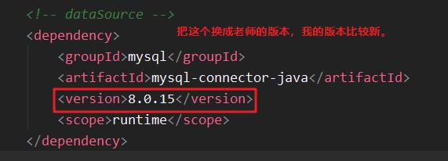
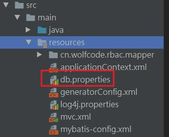
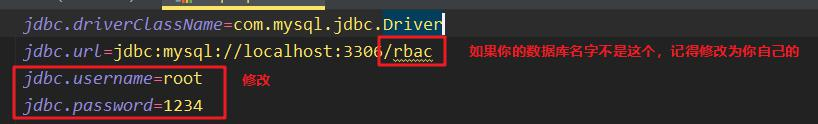

# 文件结构

# 修改步骤
* 把这两文件替换掉你的工程同名的文件（src 、 pom.xml）

* 打开pom.xml 文件 ，修改如下
	
	* 
	
* 打开 src\main\resources下的

   
  修改 你的MySQL 用户名，密码。
  
  然后自己运行tomcat.

  **注：README.md 和 README_files 两文件是文档素材，不要复制到你的工程里面。**
